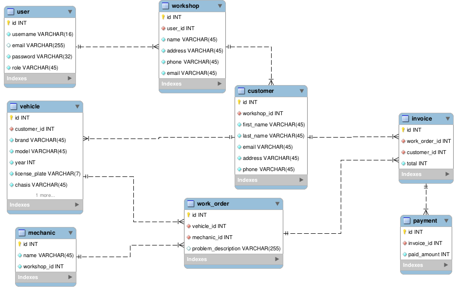

# 
Entrega de proyecto final

## Alumno

- Rodríguez Luciano

### Comisión

- SQL 53175

### Profesor

- Anderson Michel Torres

### Tutor

- Jonatan Canchi

---

## Temática del Proyecto

El proyecto tiene como temática principal la gestión integral de información para un taller mecánico. Se centra en proporcionar una plataforma sólida para administrar clientes, vehículos, órdenes de trabajo, facturación y pagos. El objetivo es mejorar la eficiencia operativa y facilitar el seguimiento detallado de las reparaciones realizadas en el taller.

## Modelo de negocio

Este sistema está diseñado para facilitar la administración de todas las operaciones y datos relacionados con el funcionamiento del taller, desde la gestión de clientes y vehículos hasta el seguimiento de órdenes de trabajo, facturación y pagos.

El objetivo principal de este modelo es proporcionar una plataforma centralizada y eficiente para registrar, organizar y gestionar toda la información necesaria para el funcionamiento diario del taller mecánico. Algunos aspectos clave del modelo de negocio incluyen:

- Gestión de Usuarios: Permite registrar y administrar usuarios del sistema, incluyendo información como nombre de usuario, correo electrónico, contraseña y rol dentro del taller (dueño, encargado, etc.).
- Gestión del Taller: Permite mantener datos sobre el taller, incluyendo nombre, dirección, número de teléfono y correo electrónico de contacto.
- Gestión de Clientes y Vehículos: Permite registrar clientes y sus vehículos asociados, con detalles como nombres, correos electrónicos, direcciones y números de teléfono. También almacena información sobre los vehículos, como marca, modelo, año, número de placa, número de chasis y kilometraje.
- Gestión de Mecánicos: Permite mantener un registro de los mecánicos empleados en el taller, incluyendo sus nombres y la identificación del taller al que están asignados.
- Gestión de Órdenes de Trabajo: Permite crear y gestionar órdenes de trabajo para los vehículos, incluyendo la asignación de mecánicos y la descripción de los problemas a resolver.
- Gestión de Facturas y Pagos: Permite generar facturas para las órdenes de trabajo completadas y registrar los pagos recibidos.

## Diagrama entidad relacion (DER)

## Listado de tablas y descripcion

## 1. Usuario (User)

- **id (clave primaria):** Identificador único del usuario.
- **username:** Nombre de usuario para acceder al sistema.
- **email:** Dirección de correo electrónico del usuario.
- **password:** Contraseña segura del usuario.
- **role:** Rol del usuario en el taller (dueño, encargado, etc.).

## 2. Taller (Workshop)

- **id (clave primaria):** Identificador único del taller.
- **user_id:** Clave foránea que referencia al usuario dueño o encargado.
- **name:** Nombre del taller.
- **address:** Dirección física del taller.
- **phone:** Número de teléfono del taller.
- **email:** Correo electrónico del taller.

## 3. Cliente (Customer)

- **id (clave primaria):** Identificador único del cliente.
- **workshop_id:** Clave foránea que referencia al taller al que pertenece el cliente.
- **first_name:** Nombre del cliente.
- **last_name:** Apellido del cliente.
- **email:** Correo electrónico del cliente.
- **address:** Dirección del cliente.
- **phone:** Número de teléfono del cliente.

## 4. Vehículo (Vehicle)

- **id (clave primaria):** Identificador único del vehículo.
- **customer_id:** Clave foránea que referencia al cliente dueño del vehículo.
- **brand:** Marca del vehículo.
- **model:** Modelo del vehículo.
- **year:** Año de fabricación del vehículo.
- **license_plate:** Número de placa del vehículo.
- **chasis:** Número de chasis del vehículo.
- **kilometers:** Kilometraje actual del vehículo.

## 5. Mecánico (Mechanic)

- **id (clave primaria):** Identificador único del mecánico.
- **name:** Nombre del mecánico.
- **workshop_id:** Clave foránea que referencia al taller al que pertenece el mecánico.

## 6. Orden de Trabajo (Work Order)

- **id (clave primaria):** Identificador único de la orden de trabajo.
- **vehicle_id:** Clave foránea que referencia al vehículo asociado a la orden.
- **mechanic_id:** Clave foránea que referencia al mecánico asignado a la orden.
- **problem_description:** Descripción del problema a resolver.

## 7. Factura (Invoice)

- **id (clave primaria):** Identificador único de la factura.
- **work_order_id:** Clave foránea que referencia a la orden de trabajo asociada.
- **customer_id:** Clave foránea que referencia al cliente asociado.
- **total:** Monto total de la factura.

## 8. Pago (Payment)

- **id (clave primaria):** Identificador único del pago.
- **invoice_id:** Clave foránea que referencia a la factura asociada.
- **paid_amount:** Monto pagado en el pago.

## Objetos de la base de datos

## Functions

### 1. getFullName

> Esta función toma un nombre y un apellido como entrada y devuelve el nombre completo concatenado.

#

> Objetivo: Proporcionar una forma conveniente de obtener el nombre completo de una persona.

#

> Datos/Tablas Manipuladas: No manipula directamente ninguna tabla, solo realiza operaciones de concatenación de cadenas.

### 2. calculateTotalInvoice

> Esta función calcula el total de la factura para una orden de trabajo específica.

#

> Objetivo: Permitir la recuperación del total de la factura asociada a una orden de trabajo.

#

> Datos/Tablas Manipuladas: Interactúa con la tabla invoice para calcular la suma total de las facturas asociadas a una orden de trabajo específica.

## Stored Procedures

## 1. CreateUser

## Parámetros de Entrada

> p_username: Nombre de usuario (VARCHAR, longitud máxima de 16 caracteres).

> p_email: Dirección de correo electrónico (VARCHAR, longitud máxima de 255 caracteres).

> p_password: Contraseña (VARCHAR, longitud máxima de 32 caracteres).

> p_role: Rol del usuario (VARCHAR, longitud máxima de 45 caracteres).

### Funcionalidad

> Inserta un nuevo registro en la tabla user con los valores proporcionados para cada columna.

### Objetivo

> Facilitar la creación de nuevos usuarios en la base de datos.

### Interacción con la Base de Datos

> Inserta datos en la tabla user.

## Views

### 1. customer_vehicle_info

> Esta vista combina información de la tabla customer y la tabla vehicle para proporcionar detalles sobre los clientes y sus vehículos.

#

### Campos seleccionados:

> customer_id: Identificación del cliente.

> first_name: Nombre del cliente.

> last_name: Apellido del cliente.

> vehicle_id: Identificación del vehículo.

> brand: Marca del vehículo.

> model: Modelo del vehículo.

### Interacción con la Base de Datos

> Realiza una operación de JOIN entre las tablas customer y vehicle.

### 2. billing_details

> Esta vista muestra detalles de facturación, incluido el monto total de la factura y el monto total pagado.

### Campos seleccionados:

> invoice_id: Identificación de la factura.

> total: Monto total de la factura.

> total_paid: Monto total pagado para la factura.

### Interacción con la Base de Datos

> Realiza una operación de LEFT JOIN entre las tablas invoice y payment, y utiliza la función COALESCE para manejar los casos en los que no hay pagos asociados.

### 3. work_order_summary

> Esta vista proporciona un resumen de las órdenes de trabajo, incluyendo detalles del vehículo, el nombre del mecánico y una descripción del problema.

### Campos seleccionados:

> work_order_id: Identificación de la orden de trabajo.

> brand: Marca del vehículo asociado a la orden de trabajo.

> model: Modelo del vehículo asociado a la orden de trabajo.

> mechanic_name: Nombre del mecánico asignado a la orden de trabajo.

> problem_description: Descripción del problema asociado a la orden de trabajo.

### Interacción con la Base de Datos

> Realiza operaciones de JOIN entre las tablas work_order, mechanic y vehicle.

## Back up de la base de datos

Se puede generar un comando en el archivo make backup que me permite ejecutar un backup de manera manual.

## Herramientas y tecnologias usadas

- Makefile (para generar una interfaz sencilla de procesos)
- Docker (para generar un container)
- MySQL (Motor de bases de datos version: latest)
- MySQL Workbench (Interfaz grafica)
- Mockaroo (para otorgar datos ficticios)

## Como levantar el proyecto en CodeSpaces GitHub

- env: Archivo con contraseñas y data secretas
- Makefile: Abstracción de creacción del proyecto
- docker-compose.yml: Permite generar las bases de datos en forma de contenedores

#### Pasos para arrancar el proyecto

En la terminal de linux escribir :

- make si te da un error de que no conexion al socket, volver al correr el comando make
- make clean-db limpiar la base de datos
- make test-db para mirar los datos de cada tabla
- make backup-db para realizar un backup de mi base de datos
- make access-db para acceder a la base de datos
